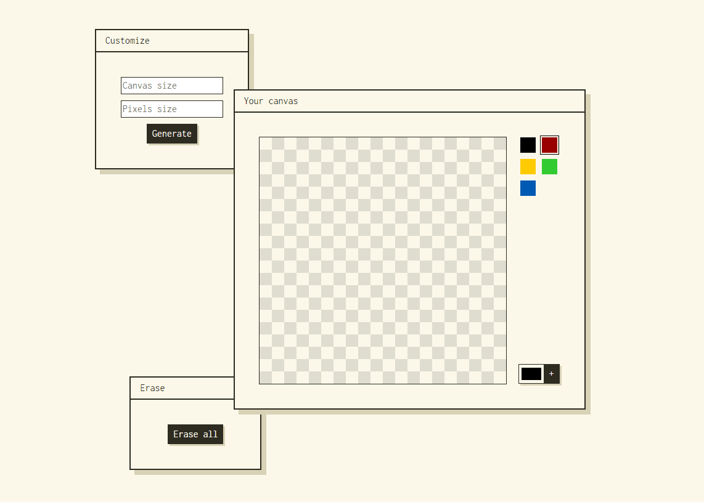

# Pixels Drawings

## About

This is my first javascript *app* that combine multiple functions and works as a whole.

The goal was to learn how to create HTML element with JS and the multiple uses of eventListeners.

### → [Play with the demo](https://kimberleybonix.github.io/Pixels-drawings/index.html) :art:

## Features

- Generate HTML element with presets
- Color a pixel on click
- Erase a colored pixel on click
- Draw with different colors
- Add custom colors
- Customize the canvas and the pixels size
- Erase the canvas
